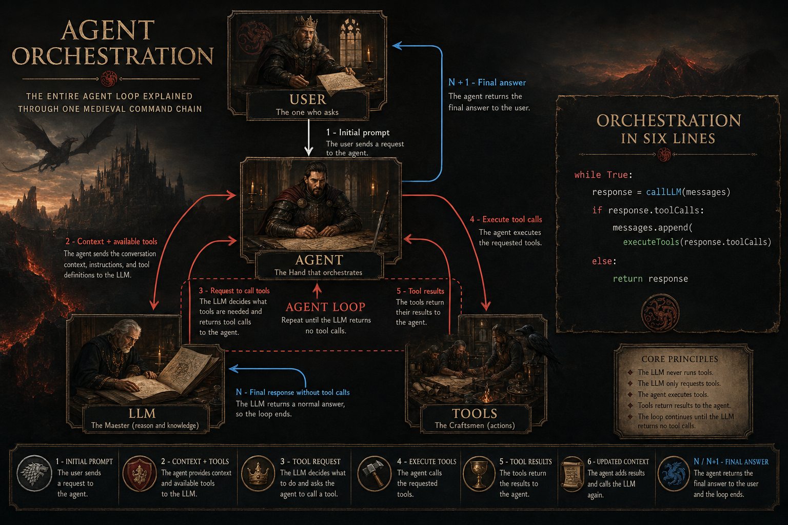

# AgentHum

AgentHum is a minimal human-in-the-loop coding agent for OpenAI-compatible
`chat/completions` APIs. It accepts a user task, sends it to an LLM, executes
tool calls, appends tool results back into the conversation, and repeats that
loop until the model returns a final answer.

The project is intentionally small: one Python file, one local command tool, one
human clarification tool, and no framework-specific SDK. It is designed to make
the mechanics of tool calling easy to inspect, modify, and extend.

The full agent implementation is currently 195 lines of Python, or 158
non-empty non-comment lines in `agenthum.py`.

The project implements a single-agent loop. It is not an MCP server, a
multi-agent platform, or a full workflow orchestrator.

## Agent Loop Schema



The diagram shows the core AgentHum cycle: the user sends a task, the agent
passes context and tool definitions to the LLM, the LLM requests tool calls, the
agent executes those tools, and tool results are appended back into the message
history until the model returns a final answer.

## Features

- Works with OpenAI-compatible servers such as Ollama, vLLM, LM Studio, and
  hosted providers that support `chat/completions`.
- Exposes a local `bash` tool for shell commands.
- Exposes an `ask_user` tool for human-in-the-loop clarification.
- Stores assistant messages, tool calls, and tool results in the conversation
  history.
- Uses only one runtime dependency: `requests`.
- Keeps the agent loop, tool schemas, and tool registry in `agenthum.py`.

## Quick Start

```bash
uv sync
python agenthum.py "Find all Python files in this directory and summarize the project"
```

Without `uv`:

```bash
python -m pip install requests
python agenthum.py "Inspect this project structure"
```

## Configuration

Configure the model connection near the top of `agenthum.py`:

| Variable | Purpose |
| --- | --- |
| `LLM_BASE_URL` | Base URL for an OpenAI-compatible server |
| `LLM_API_KEY` | API key, or a placeholder value for many local servers |
| `LLM_MODEL` | Model name accepted by the server |
| `MAX_TURNS` | Maximum number of agent-loop iterations |
| `COMMAND_TIMEOUT_SECONDS` | Timeout for one shell command |
| `TOOL_RESULT_PREVIEW_CHARS` | Number of result characters printed in the terminal preview |

Example for a local Ollama-compatible endpoint:

```python
LLM_BASE_URL = "http://localhost:11434/v1"
LLM_API_KEY = "ollama"
LLM_MODEL = "your-tool-capable-model"
```

## Model Requirements

The model must support OpenAI-style tool calling well enough to:

- Accept a `tools` array in a `chat/completions` request.
- Return `tool_calls` with a stable `id`, `function.name`, and JSON
  `function.arguments`.
- Accept follow-up `tool` messages that reference the original `tool_call_id`.
- Produce valid JSON arguments for simple function schemas.
- Reason over command output and decide whether to call another tool, ask the
  user for clarification, or finish.

Practical recommendations:

- Use an instruction-tuned model with coding and tool-use ability.
- Use a context window of at least 8k tokens for tiny projects; 32k+ is more
  comfortable for real codebases.
- Keep temperature low, usually `0.0` to `0.3`, for command execution and code
  edits.
- Small local models may work for simple inspection tasks, but stronger coding
  models are more reliable for multi-step tool use.
- If a model often emits malformed JSON or ignores tool schemas, it is not a good
  fit for AgentHum.

## System Requirements

- Python 3.10 or newer.
- Network access to the configured LLM server.
- A terminal session for `ask_user`.
- A shell environment for the `bash` tool.
- `requests>=2.31.0`.
- `uv` is optional but convenient for dependency management.

AgentHum itself is lightweight. CPU, memory, and GPU requirements mostly come
from the LLM server you connect to. If the model runs locally, follow that
model/server's hardware requirements.

## Available Tools

`bash(command)` runs a shell command locally and returns the exit code, stdout,
and stderr. It is useful for development and demos, but it is powerful: the model
can execute commands on your machine.

`ask_user(question)` asks a short question in the terminal and returns the human
answer to the model. Use it when the agent lacks required context or needs a
decision that cannot be inferred safely from files or command output.

## Agent Loop

```text
User prompt
    |
    v
AgentHum creates message history
    |
    v
LLM chat/completions request
    |
    +--> regular answer --> finish
    |
    +--> tool call: bash(command)
    |         |
    |         v
    |   local subprocess.run
    |         |
    |         v
    |   tool result added to history
    |
    +--> tool call: ask_user(question)
              |
              v
        human answer in terminal
              |
              v
        tool result added to history
```

1. The user passes a task as a command-line argument.
2. AgentHum adds the system prompt and sends the message history to the LLM.
3. If the model requests a tool, AgentHum dispatches the matching local Python
   function.
4. The tool result is added to the conversation as a `tool` message.
5. The loop continues until the model returns a normal assistant message.

## Tool Calling Structure

Each tool has three parts:

1. A schema in `LLM_TOOLS`, which is the contract shown to the model.
2. A Python function, which performs the real local action.
3. A registry entry in `TOOL_HANDLERS`, which maps the model-facing tool name to
   the Python function.

Example schema for `ask_user`:

```python
{
    "type": "function",
    "function": {
        "name": "ask_user",
        "description": "Ask the human operator a short clarification question and return their answer.",
        "parameters": {
            "type": "object",
            "properties": {
                "question": {
                    "type": "string",
                    "description": "A concise question that is necessary to continue the task.",
                }
            },
            "required": ["question"],
        },
    },
}
```

Implementation:

```python
def ask_user(question: str) -> str:
    print(f"\n❓ Agent asks: {question}")
    answer = input("Your answer: ").strip()
    return answer or "(no answer provided)"
```

Registration:

```python
TOOL_HANDLERS = {
    "bash": run_bash,
    "ask_user": ask_user,
}
```

## Agent, Orchestrator, Multi-Agent, MCP

An agent runs a decision loop around an LLM: it receives a task, asks the model
for the next step, executes tools, returns results, and stops when the model
finishes.

A multi-agent system runs more than one agent, often with separate roles such as
planner, coder, reviewer, tester, or researcher.

An orchestrator coordinates steps, workers, tools, queues, retries, state, or
multiple agents. It may contain agents, but orchestration is the coordination
layer, not the LLM loop by itself.

MCP is a protocol for exposing external tools, resources, and prompts to agents
or clients. AgentHum does not run an MCP server and does not speak MCP. A future
version could add MCP clients as one way to discover or call tools.

## Good Next Tools

For production use, reduce dependence on a broad `bash` tool and add narrower,
auditable tools:

- `read_file(path)` with path validation and output-size limits.
- `list_files(path)` for controlled project inspection.
- `search_text(query, path)` as a constrained wrapper around `rg`.
- `apply_patch(diff)` for safer edits than shell-written files.
- `run_tests(command)` with an allowlist of test commands.
- `confirm_action(action)` before destructive operations.
- `http_get(url)` with a domain allowlist.

Narrow tools give the model less arbitrary power and make behavior easier to
review, log, and restrict.

## Security

AgentHum can execute commands on your machine. Run it only with models and tasks
you trust. Before using it on real projects, add command allowlists, dangerous
pattern checks, path restrictions, and explicit confirmation before changing or
deleting files.

## Requirements

- Python 3.10+
- `requests>=2.31.0`
